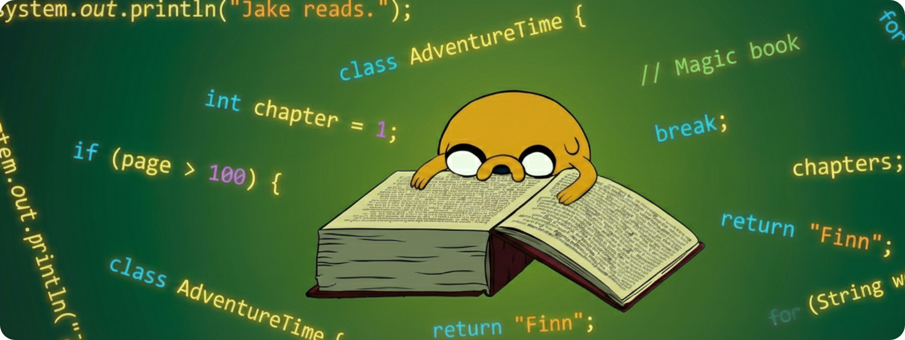

  

¡Hola! Soy Gabriel 👋

Soy un desarrollador multiplataforma apasionado por toda la tecnología, siempre buscando aprender cosas nuevas y mejorar mis habilidades. Aquí puedes ver un poco más sobre las herramientas y tecnologías con las que trabajo:

### 👨‍💻 Sobre mí
- 🔭 Actualmente trabajando en **mis proyectos personales y portafolio**.
- 📚 Profundizando mis conocimientos en el desarrollo con diferentes frameworks y arquitecturas.

---

### 🛠️ Tecnologías y Herramientas

  
   
  
<i>*También tengo experiencia trabajando con Oracle, XML y XSLT.</i>

---

### 🚀 Mis Proyectos

- 📱 **[Aeris WeatherApp](https://github.com/gbri29hr/Aeris-WeatherApp)** - Pequeña app del tiempo con ciudades de España, que consulta a la api de OpenWeather. 
- 💻 **[Gestion Crud Angular](https://github.com/gbri29hr/Gestion-Crud-Angular)** - Gestion Crud en Angular con (Partidos, Ligas, Arbitros, Jugadores)

---

### 📫 Conecta conmigo

